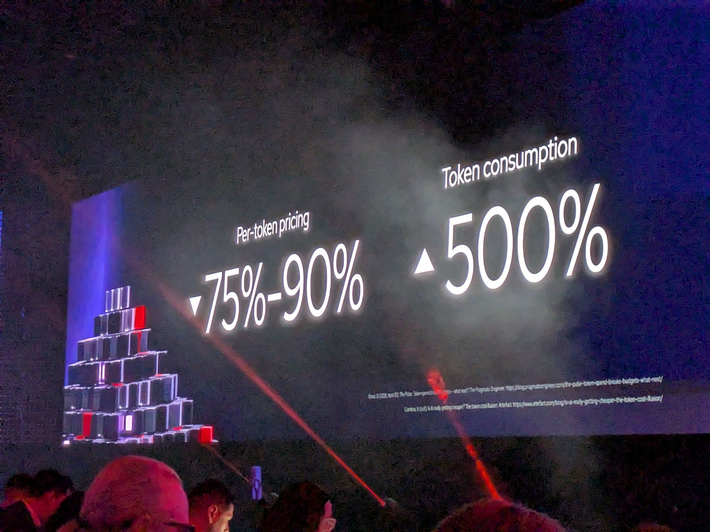
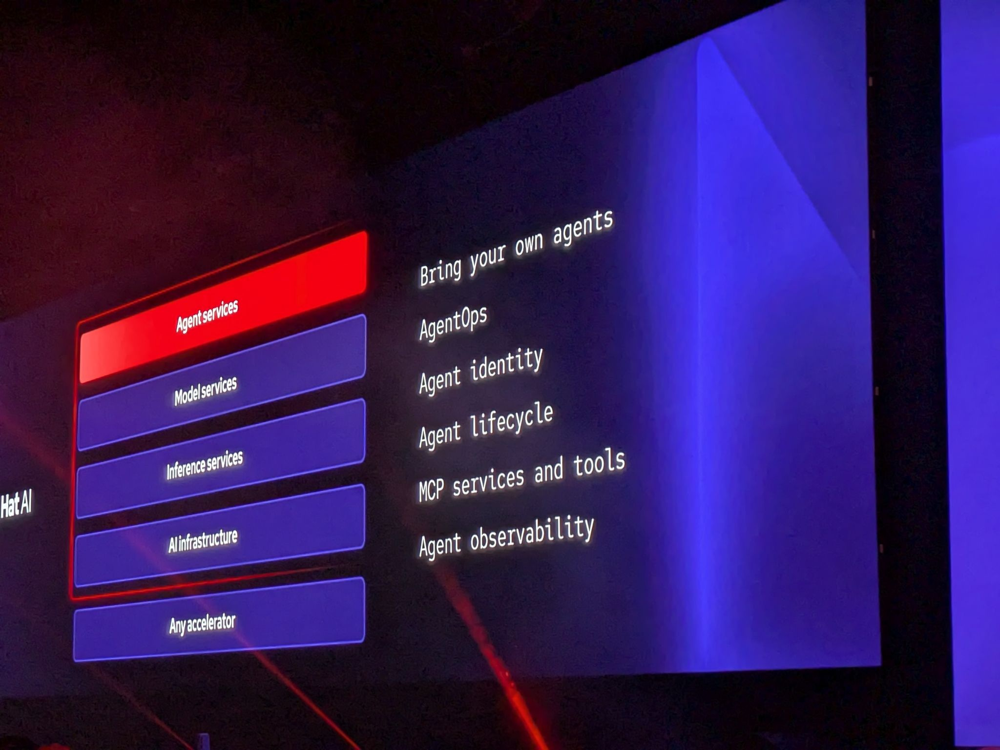
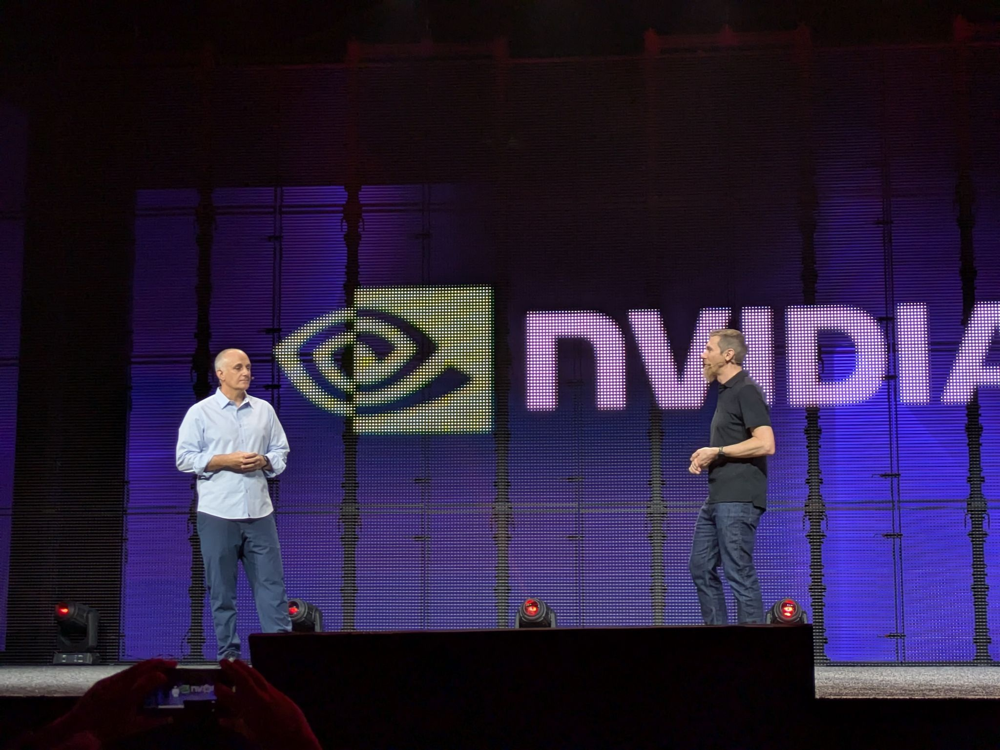

# The Next Platform Is Choice

- Date/Time (EDT): 2026-05-12, 8:30 AM - 10:00 AM
- Session Type: Keynote
- Source Folder: otter_summaries/2026_12/RH_SUMMIT_DAY2_KEYNOTE_1
- YouTube: https://www.youtube.com/watch?v=PgMSUGL4N5o

## Overview
This keynote frames enterprise infrastructure teams as operating under simultaneous pressure: rising complexity, constrained budgets, strict uptime requirements, and an immediate expectation to deliver AI outcomes. Red Hat leadership positions this moment as a third platform inflection point after Linux and cloud-native: AI at enterprise scale must be built on open foundations rather than single-vendor lock-in.

Across the session, speakers argue that virtual machines, containers, and agents are converging rather than competing. The proposed operating model is a unified hybrid platform where organizations can modernize legacy estates, introduce AI workloads, and maintain governance and resilience in regulated environments.

Customer stories from Motorola, Core42, Telenor, BNP Paribas, and Verizon are used to anchor the narrative in production outcomes. Themes include digital sovereignty, token economics, multi-model strategies, enterprise-grade inference, and governance for agentic systems.

## Key Themes
- Enterprise IT's central constraint is the gap between system complexity and available resources.
- Open platforms are presented as the durable strategy for long-term AI flexibility.
- Hybrid architecture is framed as a requirement, not a compromise, in regulated sectors.
- AI sovereignty is defined as model sovereignty, data sovereignty, and outcome sovereignty.
- Agentic AI introduces cost, security, and operational control challenges that require platform governance.
- Production AI success depends on owning parts of inference infrastructure and model choice.

## Chronological Notes
### Opening Narrative: Operational Reality and Platform Choice
- Matt Hicks emphasizes that infrastructure teams are responsible for systems that cannot fail.
- He frames a recurring industry question: what foundation can support innovation without breaking mission-critical operations.
- Red Hat positions Linux as the first foundational shift and OpenShift/cloud-native as the second.
- The keynote presents AI as the third shift where foundation quality matters more than short-term velocity.

### Red Hat Internal AI Journey
- Red Hat describes moving from chatbot use cases to multi-agent workflows.
- The journey started with frontier models, then optimized layer-by-layer with open-weight models.
- Reported outcome: major call volume shifted to open models on controlled infrastructure, with improved efficiency and quality.

### Infrastructure Modernization and Hybrid Operations
- Ashesh Badani focuses on the virtualization cost crisis and migration complexity.
- OpenShift is presented as a unified operating model for VMs, containers, and AI workloads.
- Red Hat cites large migration-scale activity and phased migration tooling.

### Sovereignty, Compliance, and Regional Control
- The keynote highlights regulatory expansion (EU and sector-specific requirements).
- New and updated sovereignty capabilities are positioned for data, technology, and operations control.
- Customer examples (Eurocontrol, Core42, Telenor) emphasize geographically constrained support, audited operations, and in-region control.

### AI Platform Architecture and Token Economics
- Chris Wright describes rapid AI cycle compression and the need for strategy agility.
- Token pricing decline is contrasted with sharply increasing token consumption from reasoning and agents.
- Core claim: organizations must move from pure token consumption to partial token provision by controlling inference infrastructure.
- Red Hat AI Enterprise is presented as a "metal to agents" stack spanning accelerators, runtime, inference services, model services, and agent services.

### AgentOps and Enterprise Controls
- Agent management is positioned around identity, lifecycle, tool access, observability, and policy.
- Model-as-a-service and agents-as-a-service are framed as governance mechanisms for scale.
- BNP Paribas and Verizon examples emphasize industrialized AI with measurable business impact.

## Technologies and Projects Mentioned
| Name | Type | Notes |
|---|---|---|
| RHEL | OS platform | Enterprise Linux foundation for mixed workload environments |
| OpenShift | Kubernetes platform | Unified operation for VMs, containers, and AI workloads |
| vLLM | Inference runtime | High-performance LLM serving used in Red Hat AI stack |
| llm-d | Distributed inference framework | Request routing/scheduling and scale-out inference support |
| Nemotron | Model family | Referenced in open-weight model optimization path |
| IBM Granite | Model family | Referenced in Red Hat internal model stack |
| MCP | Agent protocol/tooling | Mentioned as part of enterprise agent interoperability |
| TrustyAI | AI guardrail/evaluation integration | Cited in model safety and control context |

## Notable Claims and Metrics
- "85%" of calls in Red Hat's deep research agent system were described as running on open-weight models.
- VM migration and assessment figures were presented at high enterprise scale.
- BNP Paribas was cited as generating significant incremental value through AI industrialization.
- Verizon highlighted large-scale network operations and autonomous closed-loop actions.

## Extracted Visuals (From PDF)
These images were extracted automatically from the keynote PDF and can be used when enriching section-level notes.

- 
- 
- 

## Actionable Follow-Ups
1. Track which AI workloads should remain on frontier APIs vs. move to self-hosted/open models.
2. Define governance requirements for agent identity, policy boundaries, and traceability before broad rollout.
3. Evaluate where hybrid architecture is mandatory due to latency, regulation, or sovereignty constraints.
4. Establish a repeatable token economics review that includes reasoning and agentic workload growth.
