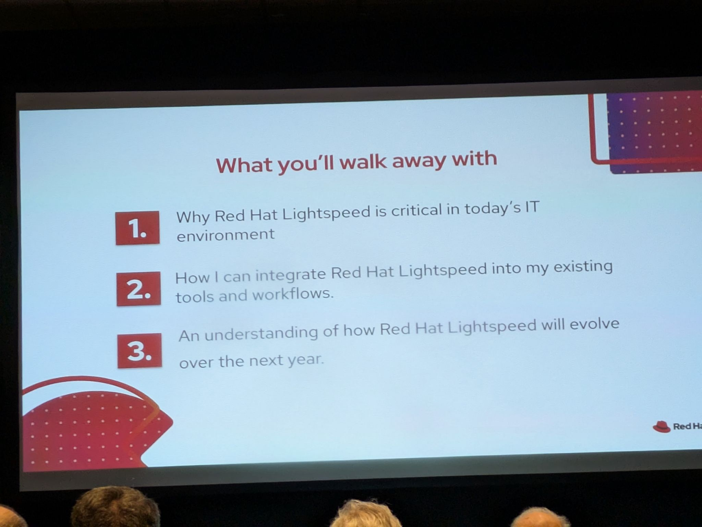
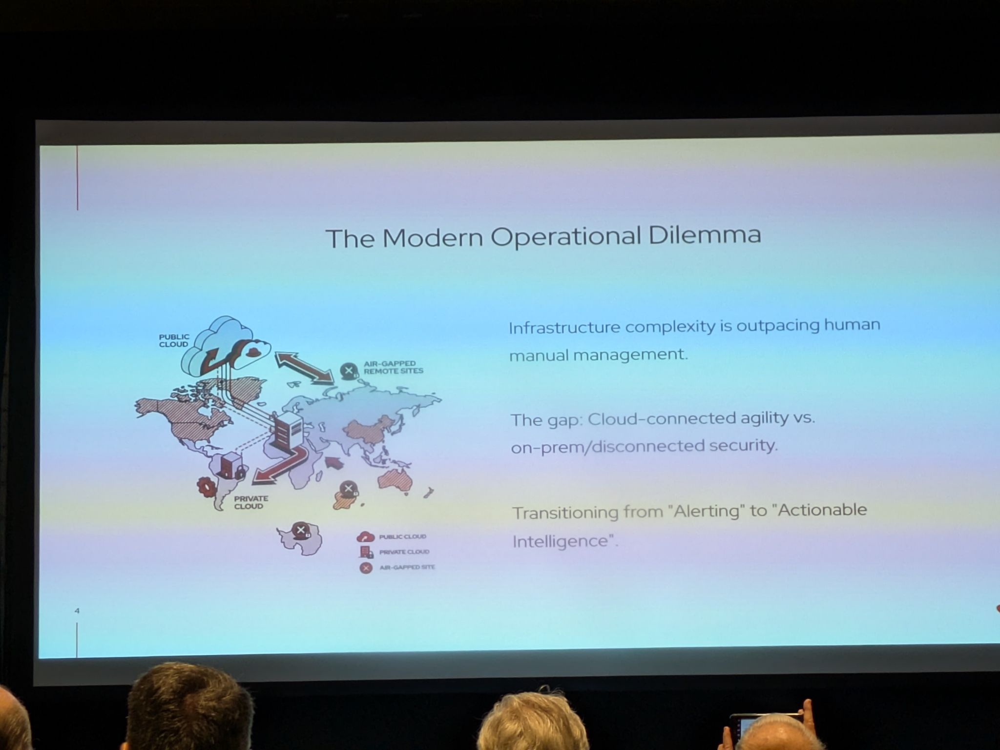
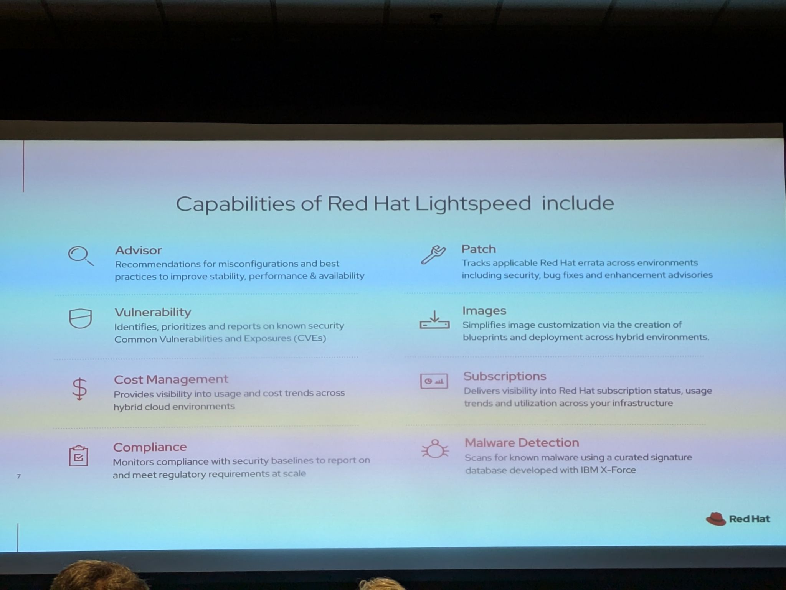
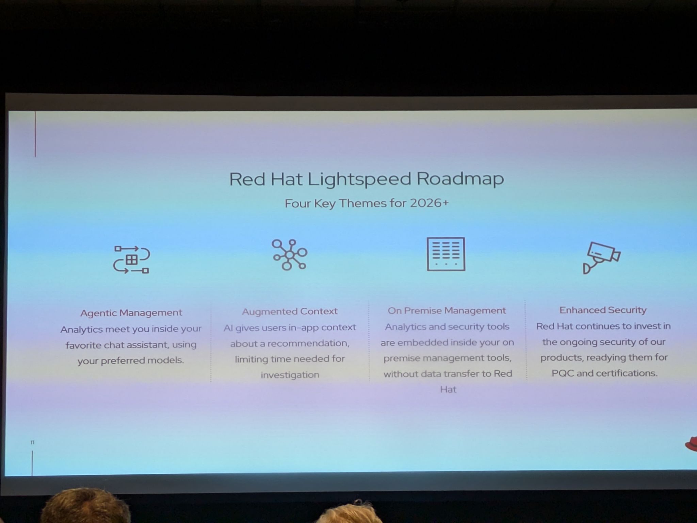

# The Future of Red Hat Lightspeed

- Date/Time (EDT): 2026-05-12, 11:45 AM - 12:25 PM
- Session Type: Session
- Source Archive Ref: 2026_12/redhat_lightspeed_roadmap

## Overview
This session presents Red Hat Lightspeed as the evolution of Red Hat Insights from a mostly diagnostic toolset into a broader operational-intelligence platform. The speakers frame the problem as one of scale: infrastructure complexity is rising faster than humans can investigate alerts, prioritize action, and safely remediate issues by hand.

The roadmap centers on four themes: agentic management, augmented context, on-premise management, and enhanced security. Across all four, the consistent message is that Red Hat wants analytics, remediation guidance, and AI-assisted operations to show up inside the tools customers already trust, including restricted and disconnected environments.

## Key Themes
- Red Hat Lightspeed is the next step beyond connected insights and static recommendations.
- Operational intelligence is framed as a lifecycle of identify, prioritize, and resolve.
- AI is being used to add context and actionability, not just more alerts.
- MCP-based integrations and agentic workflows are becoming part of the management story.
- Security posture remains central, especially for on-prem, regulated, and post-quantum-sensitive environments.

## Chronological Notes
### Reframing the Problem
- The session opens by renaming the challenge: infrastructure complexity is outpacing human manual management.
- The presenters describe a persistent tension between cloud-connected agility and the security requirements of on-prem or disconnected operations.
- This is used to justify moving from alerting toward what they call actionable intelligence.

### Current Lightspeed Capability Set
- Red Hat Lightspeed inherits and expands the established Insights-style services: Advisor, Vulnerability, Cost Management, Patch, Images, Subscriptions, Compliance, and Malware Detection.
- The platform story is built around continuous scanning, AI-assisted prioritization, and automated remediation through existing tools such as Ansible Playbooks and Red Hat Satellite.
- The talk consistently positions Lightspeed as a way to reduce troubleshooting time while keeping governance intact.

### Recent Deliverables
- The roadmap slide highlights a dense set of near-term deliverables, including MCP for Image Builder, OpenShift incident detection, recommendations for RHEL AI, and broader integrations with tools such as ServiceNow and Splunk.
- Other additions include improved onboarding, redesigned user experience, dependency checks, and role/workspace refinements.
- The practical takeaway is that Lightspeed is being expanded across imaging, remediation, integrations, and AI-assisted recommendations at the same time.

### Four Roadmap Themes
- Agentic management focuses on making hosted and on-prem Lightspeed data accessible through MCP servers, reducing token usage through skills, and validating recommended models.
- Augmented context aims to explain findings more clearly, especially around security and malware context.
- On-premise management is about bringing analytics and security capabilities inside the customer's firewall without forcing data transfer back to Red Hat.
- Enhanced security includes PQC readiness, ISO 42001 alignment, and broader partner coverage for detection and remediation.

### Strategic Direction
- The talk's broader claim is that Lightspeed is becoming a shared intelligence layer across RHEL, OpenShift, and automation environments.
- Rather than inventing a separate AI console, the plan is to embed analytics and guided action inside the workflows operators already use.

## Technologies and Projects Mentioned
| Name | Type | Notes |
|---|---|---|
| Red Hat Lightspeed | Operations platform | New umbrella identity for what was formerly Red Hat Insights |
| Advisor | Recommendation engine | Surfaces configuration and stability recommendations |
| Red Hat Satellite | Management platform | Referenced as a remediation target in the lifecycle |
| MCP | Integration protocol | Used in the roadmap for agentic and tool-based access |
| ServiceNow | IT operations platform | Cited as an integration partner |
| Splunk | Observability platform | Cited as an integration partner |
| CrowdStrike | Security tooling | Mentioned in malware/signature integration context |

## Notable Takeaways
1. Lightspeed is being positioned as an action-oriented intelligence layer, not just a reporting surface.
2. Red Hat is explicitly designing AI and analytics features for disconnected and regulated environments.
3. MCP and agentic workflows are becoming part of mainstream enterprise management rather than side experiments.
4. The roadmap balances AI assistance with conservative security priorities such as auditability, on-prem deployment, and PQC readiness.

## Representative Visuals
Representative visuals retained from transcript-style PDFs or source photos:

- 
- 
- 
- 