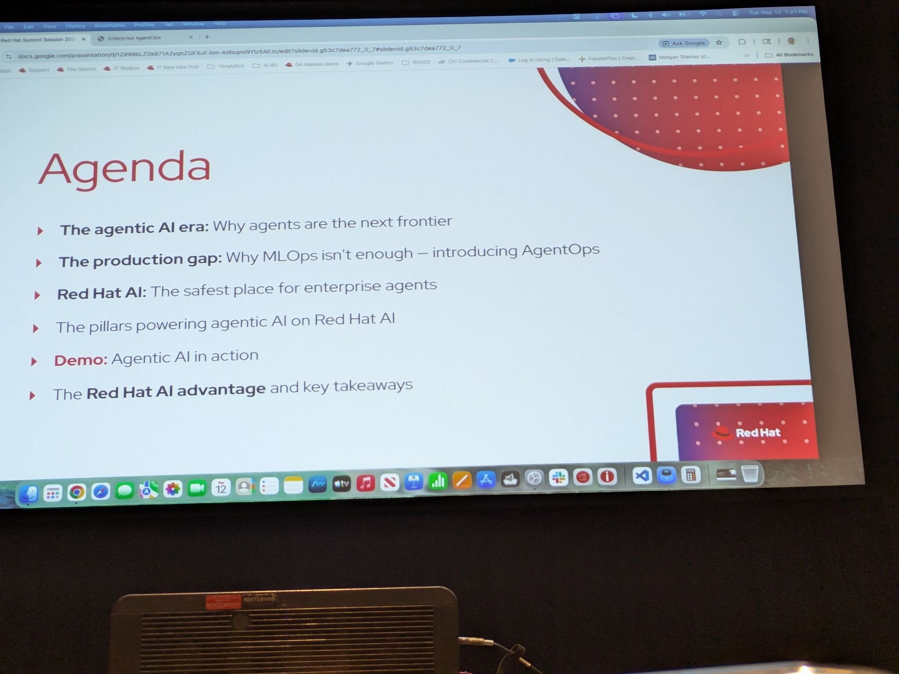
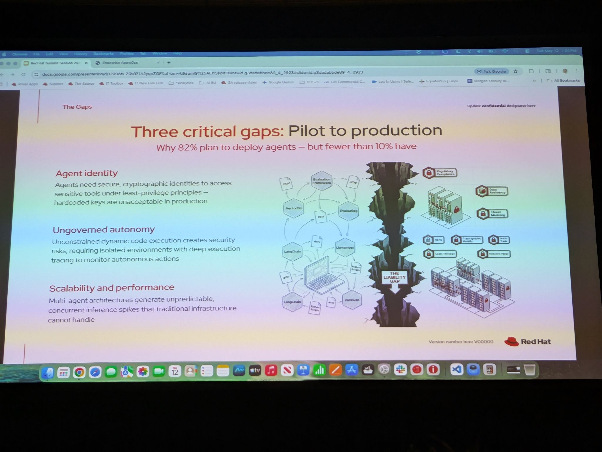
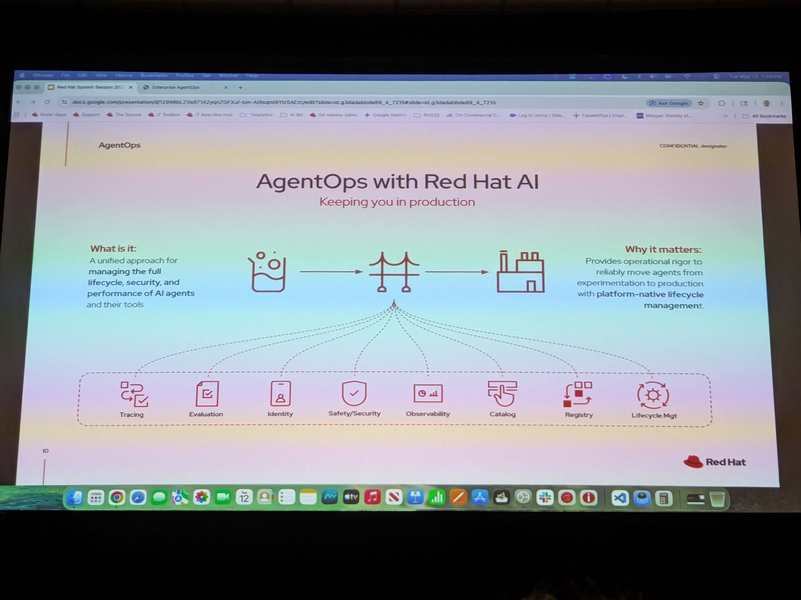

# Beyond MLOps: Establishing AgentOps for Enterprise AI on Red Hat AI

- Date/Time (EDT): 2026-05-12, 1:00 PM - 1:40 PM
- Session Type: Session
- Source Folder: otter_summaries/2026_12/Beyond_MLOps_agentOps_for_enterpriseAI_RHOAI

## Overview
This talk argues that the operational problem for enterprise AI has shifted. MLOps is still necessary for models, but once organizations move from chatbots to autonomous or semi-autonomous agents, the real challenge becomes AgentOps: securing, tracing, evaluating, and governing systems that can make decisions and take actions across production infrastructure.

The presenters position Red Hat AI as a platform for closing the gap between impressive demos and production-ready agentic systems. Their framing is that enterprises are not blocked by lack of models or frameworks; they are blocked by identity, sandboxing, observability, safety, lifecycle management, and scalable inference for multi-agent workloads.

## Key Themes
- Agentic AI raises the blast radius because systems can act, not just generate content.
- Production readiness requires identity, isolation, tracing, evaluation, and governance.
- Bring-your-own-agent flexibility is important, but enterprises still need standard control points.
- MCP, skills, cataloging, and registries become governance surfaces, not just developer conveniences.
- Red Hat AI's value proposition is infrastructure and control-plane rigor from metal to agents.

## Chronological Notes
### From Generative AI to Agentic AI
- The session begins by distinguishing content generation from action execution.
- A basic LLM workflow has lower autonomy and lower risk, while multi-agent systems and autonomous planners create more business value but also more exposure.
- The presenters cite strong adoption momentum, but they emphasize that adoption is not the same thing as production readiness.

### The Production Gap
- Three major problems are called out: agent identity, ungoverned autonomy, and scalability/performance.
- In pilots, teams often hard-code credentials and over-broaden access, but that approach is unacceptable in regulated environments.
- Agents also need execution isolation, deep tracing, and behavior evaluation to make post-incident review possible.

### AgentOps Control Planes
- The speakers describe AgentOps in three broad areas: observe/trace/evaluate, identity/security, and reliable develop/deploy governance.
- That governance scope explicitly includes models, agents, skills, MCP servers, and related assets.
- The presentation frames catalogs, registries, lifecycle management, and safety controls as first-class requirements for enterprise agents.

### Platform Architecture
- Red Hat AI is presented as framework-agnostic, supporting external models alongside platform-native inference through vLLM, LLMD, and models as a service.
- The stack includes safety and guardrails, MCP gateway control, knowledge and memory sources, and observability across the full agent workflow.
- A recurring theme is optionality without losing governance.

### Demo Highlights
- The demo path shows how an existing agent can be imported and then hardened with additional production layers.
- Specific hardening steps include cryptographic identity, sandboxed execution, MCP gateway policy, end-to-end tracing, and guardrails.
- The overall message is that enterprises should be able to bring their own agents and then make them production-ready rather than rebuilding everything from scratch.

## Technologies and Projects Mentioned
| Name | Type | Notes |
|---|---|---|
| Red Hat AI | Enterprise AI platform | Presented as the operational foundation for AgentOps |
| SPIFFE/SPIRE | Identity system | Used to give agents short-lived cryptographic identities |
| vLLM | Inference engine | Provides performant model serving |
| LLMD | Distributed inference layer | Routes and scales inference requests across a fleet |
| Models as a Service | Model access layer | Provides access to internal and external models with governance |
| MCP Gateway | Control plane component | Restricts and observes tool access for agents |
| TrustyAI and NeMo Guardrails | Safety tooling | Used for evaluation, guardrails, and safer agent behavior |

## Notable Takeaways
1. The hardest enterprise AI problem is no longer model access; it is operational control over autonomous behavior.
2. Agent identity and sandboxing are foundational, not optional add-ons.
3. Observability must include decisions, tool calls, and evaluation signals, not only infrastructure metrics.
4. AgentOps is the governance layer that turns bring-your-own-agent experimentation into something an enterprise can actually run.

## Representative Visuals
Representative visuals retained from transcript-style PDFs or source photos:

- 
- 
- 
- 