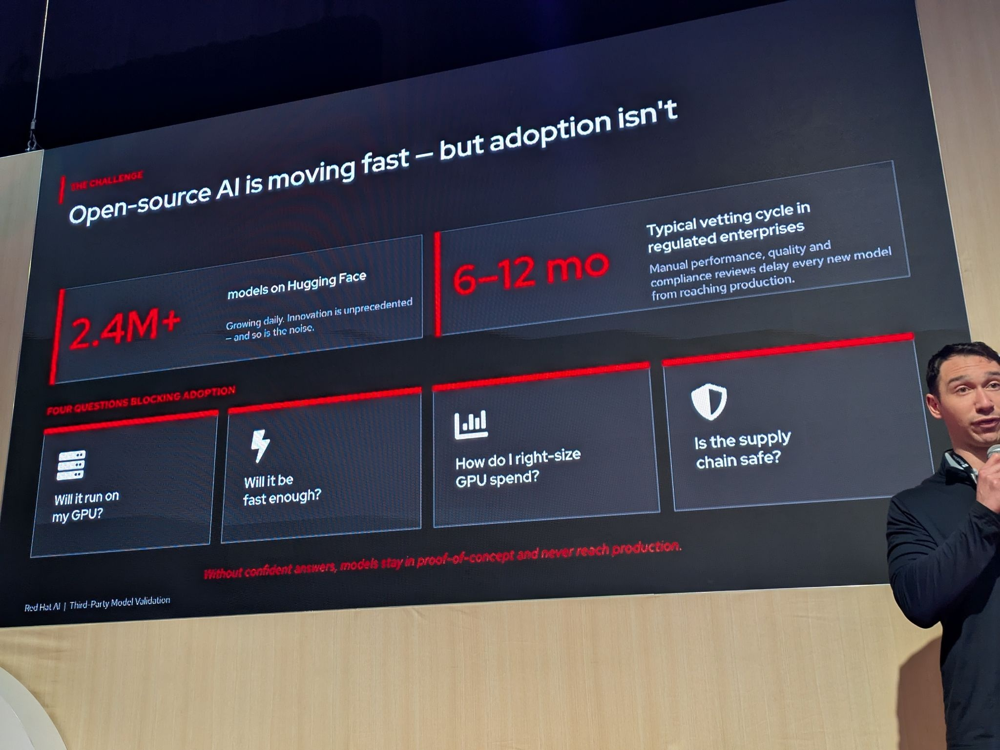
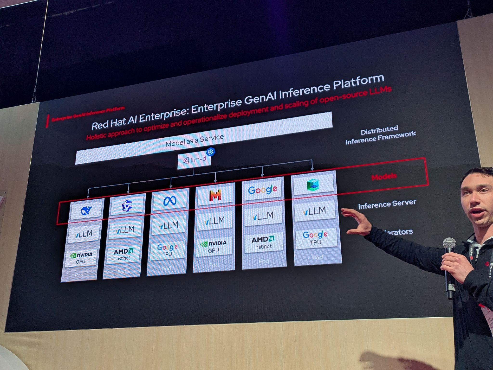
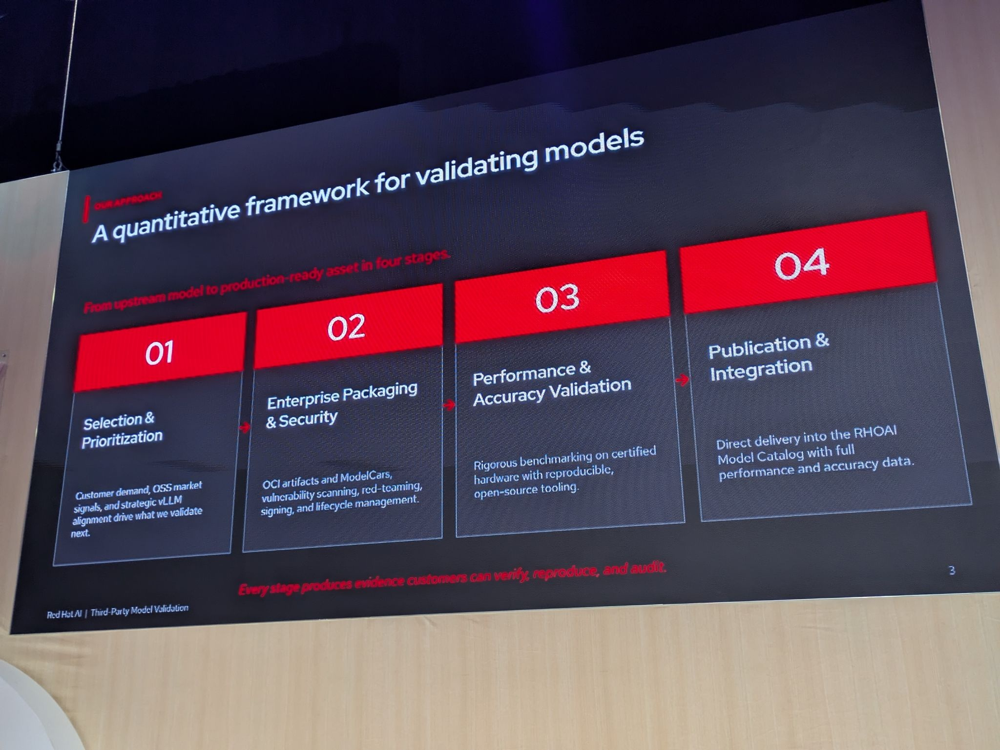
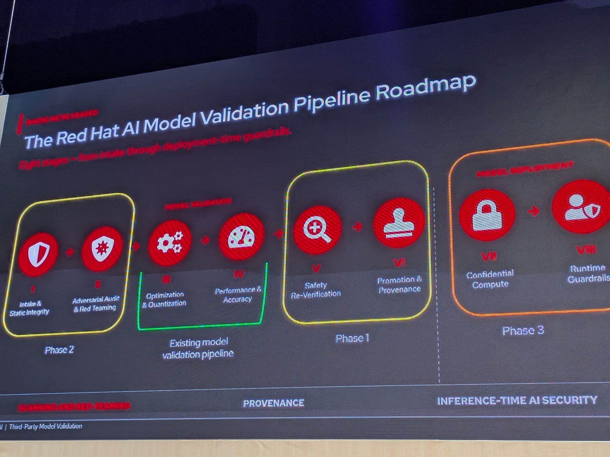

# Chain of Trust: The Hidden System Behind Validated and Benchmarked AI Models

- Date/Time (EDT): 2026-05-12, 3:30 PM - 3:50 PM
- Session Type: Session
- Source Archive Ref: 2026_12/chain_of_trust_hidden_system_behind_validated_and_benchmarked_ai_models

## Overview
This session explains the model-validation pipeline Red Hat is building to turn fast-moving upstream models into deployable enterprise assets. The core problem is simple: there are now millions of open models available, but enterprises still need defensible answers on hardware fit, performance, cost, and supply-chain integrity before they can move a model into production.

The speakers position Red Hat AI Model Validation as that missing middle layer. Instead of making every customer repeat months of manual vetting, the pipeline produces repeatable evidence across selection, packaging, benchmarking, evaluation, and publication into the Red Hat OpenShift AI model catalog.

## Key Themes
- Open-source model abundance does not remove the need for enterprise validation.
- Benchmarking and evaluation must be reproducible, auditable, and hardware-specific.
- Performance and accuracy should be treated as a combined validation problem.
- Packaging, provenance, and security are part of model readiness, not post-processing.
- The long-term roadmap extends from benchmarking into adversarial testing, provenance, and runtime guardrails.

## Chronological Notes
### Enterprise Problem Statement
- The talk opens with the mismatch between upstream model velocity and enterprise adoption velocity.
- Hugging Face may have millions of models, but regulated organizations still face six-to-twelve-month vetting cycles.
- Four customer questions are used to frame the challenge: will the model run on my hardware, will it be fast enough, how do I right-size spend, and is the supply chain safe?

### The Current Validation Pipeline
- Red Hat presents a four-stage process: selection and prioritization, enterprise packaging and security, performance and accuracy validation, and publication plus integration.
- The stated outcome is evidence that customers can reproduce and audit rather than a black-box recommendation.

### Benchmarking and Evaluation Stack
- Performance benchmarking is described as being powered by GuideLLM, with tests across certified hardware and multiple workload types.
- Accuracy evaluation is powered by LM-Eval-Harness and includes both standardized benchmarks and use-case-specific scoring.
- The pipeline also compares compressed or quantized models against baselines to confirm that optimization does not erase useful quality.

### Customer-Facing Deliverables
- The end product is intended to land directly in the OpenShift AI model catalog with performance and accuracy data attached.
- The customer value is reduced guesswork, faster model selection, and safer adoption of third-party models.
- Security-oriented roadmap items include vulnerability scanning, red-teaming, signing, and AI BOM-style transparency.

### Roadmap Direction
- The roadmap expands the pipeline into eight stages, adding adversarial auditing, safety re-verification, promotion and provenance, confidential compute, and runtime guardrails.
- The message is that validation is evolving from a benchmark program into a broader enterprise trust system.

## Technologies and Projects Mentioned
| Name | Type | Notes |
|---|---|---|
| GuideLLM | Benchmarking tool | Used for performance evaluation across hardware and workloads |
| LM-Eval-Harness | Evaluation framework | Used for standardized and use-case scoring |
| TrustyAI | Evaluation platform | Mentioned as a future convergence point for unified evaluation |
| Red Hat OpenShift AI Model Catalog | Delivery surface | Intended publication target for validated models |
| Snyk and Claire | Security scanning tools | Referenced in roadmap around model integrity and scanning |
| ModelCars | Packaging format | Part of the enterprise packaging and delivery story |

## Notable Takeaways
1. Enterprise model adoption bottlenecks are often trust and evidence bottlenecks, not model shortages.
2. Benchmark numbers only matter when customers can reproduce the environment and methodology.
3. Red Hat is treating performance, quality, and supply-chain assurance as one integrated pipeline.
4. The roadmap points toward a future where validated models come with both deployment data and security posture data.

## Representative Visuals
Representative visuals retained from transcript-style PDFs or source photos:

- 
- 
- 
- 