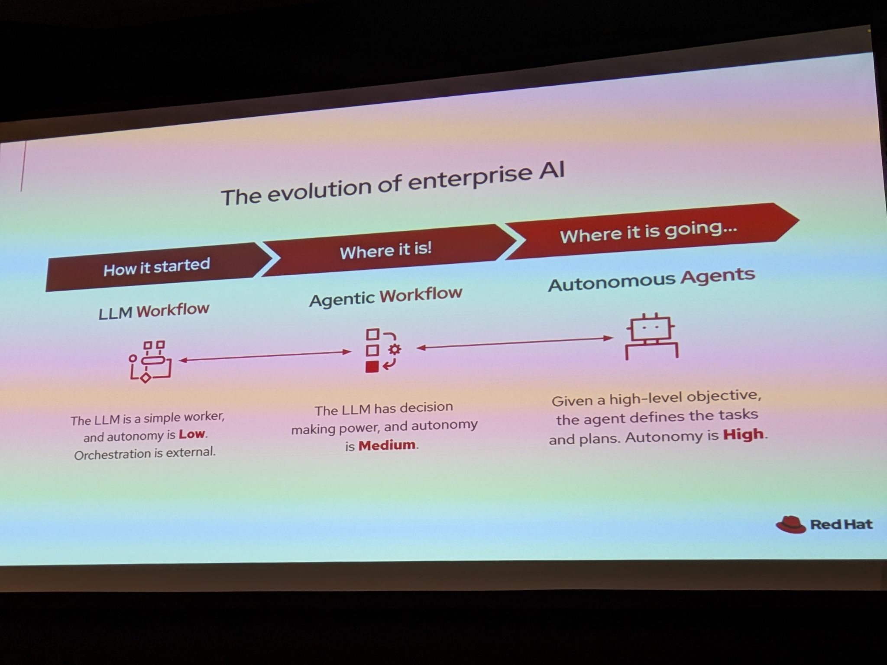
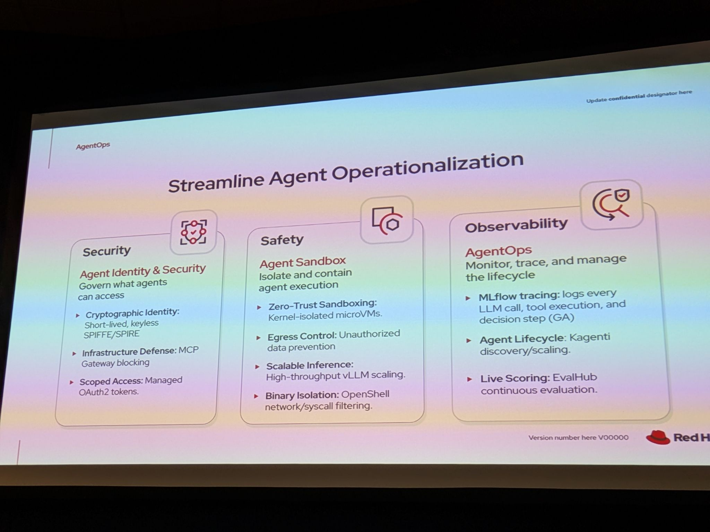
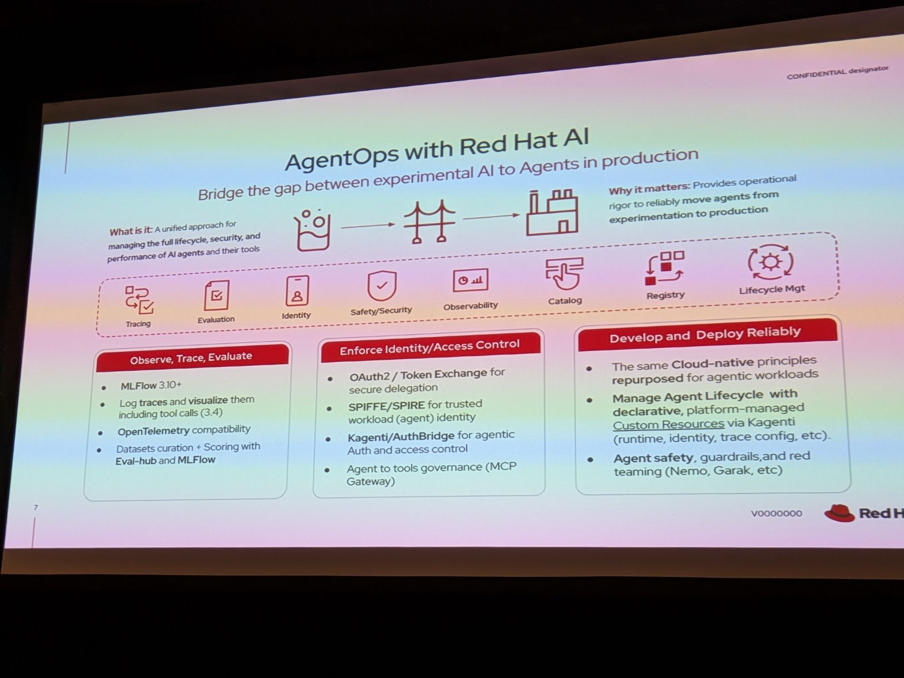

# AgentOps in Production: Agentic End-to-End Observability with Red Hat AI

- Date/Time (EDT): 2026-05-13, 10:30 AM - 12:00 PM
- Session Type: Lab
- Source Folder: otter_summaries/2026_13/agentops_in_prod_agentic_e2e_observability_with_RHOAI

## Overview
This lab focuses on one of the least glamorous but most important parts of enterprise agentic systems: making them observable enough to debug, evaluate, and trust in production. Instead of treating multi-agent behavior as a black box, the session shows how Red Hat AI can combine metrics, traces, and evaluations so teams can inspect what happened, why it happened, and whether the output quality is holding over time.

The user's note captures the key emphasis correctly: MLflow is used for auditable tracing of language-model interactions, while Grafana is used for metrics and dashboards. The supporting workshop material adds the application context: a multi-agent mortgage-lending app built with LangGraph and MCP tools is instrumented so participants can move from ad hoc experimentation to repeatable production observability.

## Key Themes
- Agentic applications need traces, metrics, and evaluations tied together rather than managed separately.
- MLflow is positioned as an audit trail for model calls, tool invocations, and decision paths.
- Grafana and the platform observability stack provide the operational health view for agents.
- Continuous evaluation is necessary to detect output quality drift, not just infrastructure failures.
- Observability is part of a broader AgentOps operating model that includes safety and security.

## Chronological Notes
### Workshop Framing
- The lab introduces a multi-agent mortgage-lending application as the concrete system being observed.
- The point is not only to watch logs, but to understand the full decision path across agents, tools, and models.

### Metrics and Operational Health
- Red Hat AI's out-of-the-box observability stack is used to monitor the application and its agent workflows.
- Grafana is highlighted as the surface for agent metrics, making latency, request behavior, and operational health visible in a way platform teams already understand.
- This grounds AgentOps in familiar SRE practice rather than inventing a separate operational discipline from scratch.

### Auditable Tracing with MLflow
- MLflow is presented as the system of record for tracing agentic execution.
- The extracted session material specifically calls out logging every LLM call, tool execution, and decision step so participants can reconstruct behavior later.
- OpenTelemetry compatibility is part of the story, reinforcing that the tracing model needs to integrate with broader enterprise telemetry, not sit apart from it.

### Evaluation as a First-Class Signal
- The lab pairs traces with continuous evaluation through EvalHub-style live scoring.
- That matters because a perfectly healthy infrastructure stack can still produce bad agent outcomes if prompts drift, tools misfire, or model behavior changes.
- The session's larger argument is that production AI needs quality signals alongside infrastructure signals.

### From Notebook to Production
- The workshop closes the loop by showing how these observability and evaluation patterns fit into automated AI pipelines.
- The takeaway is that teams should not stop at local notebook validation; they need production-grade instrumentation and automated checks once agentic systems are deployed.

## Technologies and Projects Mentioned
| Name | Type | Notes |
|---|---|---|
| MLflow | Tracing and experiment platform | Used for auditable tracing of agent and model interactions |
| Grafana | Metrics and dashboards | Used to surface agent and platform metrics |
| OpenTelemetry | Telemetry standard | Referenced for trace compatibility |
| LangGraph | Agent orchestration framework | Used in the workshop application |
| MCP | Tool integration protocol | Part of the multi-agent application context |
| EvalHub | Evaluation workflow | Used for continuous quality scoring in the session narrative |
| Red Hat OpenShift AI | AI platform | Provides the environment for observability and production workflows |

## Notable Takeaways
1. Tracing, metrics, and evaluations have to be connected if AgentOps is going to be auditable.
2. MLflow is doing more than experiment tracking here; it becomes a forensic record of agent behavior.
3. Grafana matters because platform teams need agent metrics in the same operational language as the rest of the stack.
4. Production AI quality failures are often evaluation problems, not only uptime problems.

## Representative Visuals
Representative visuals retained from transcript-style PDFs or source photos:

- 
- 
- 
- 