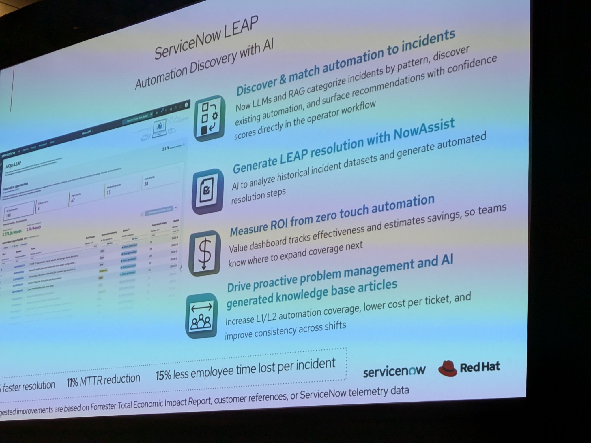
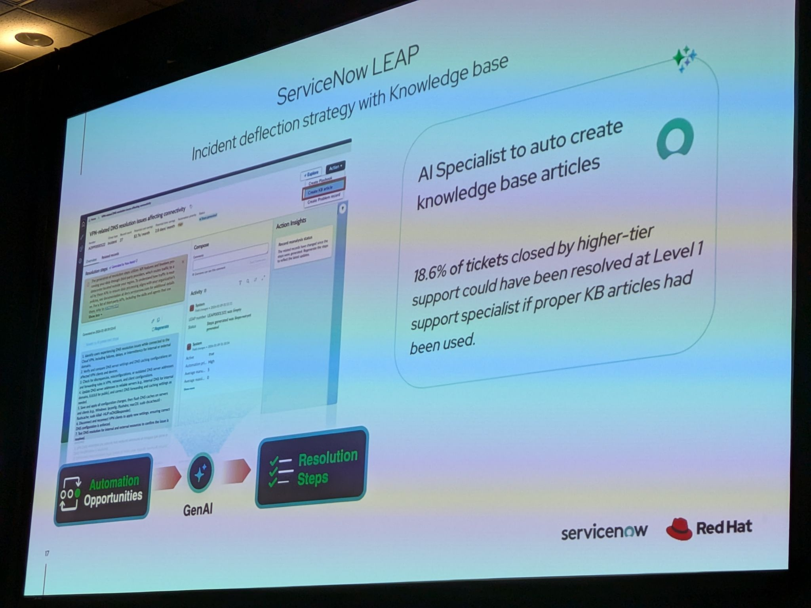
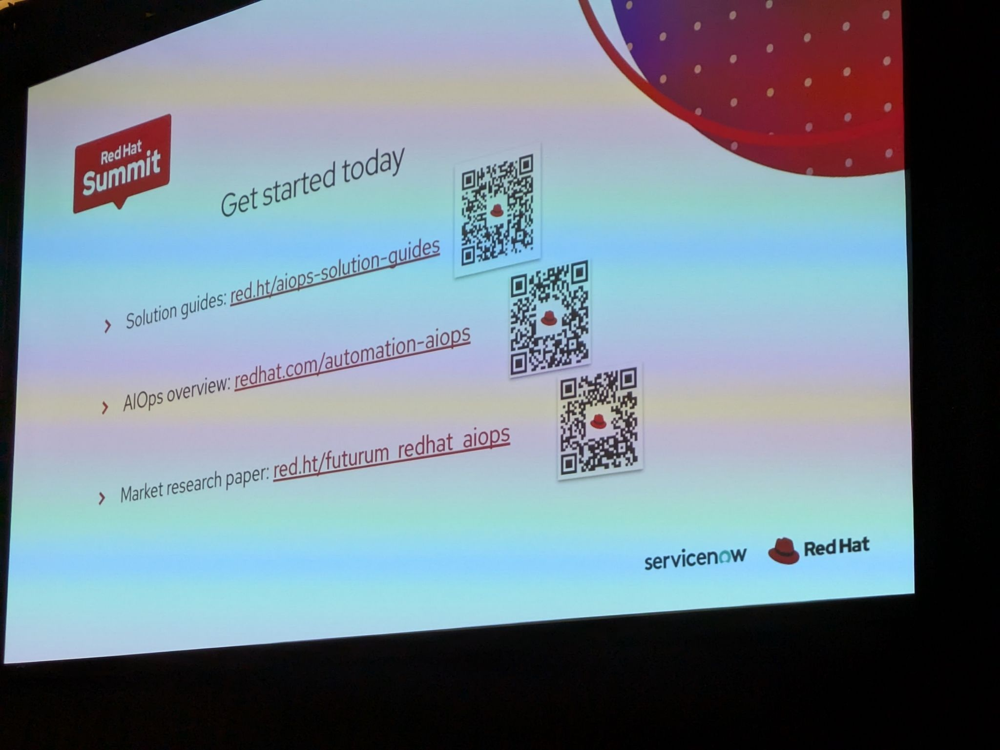
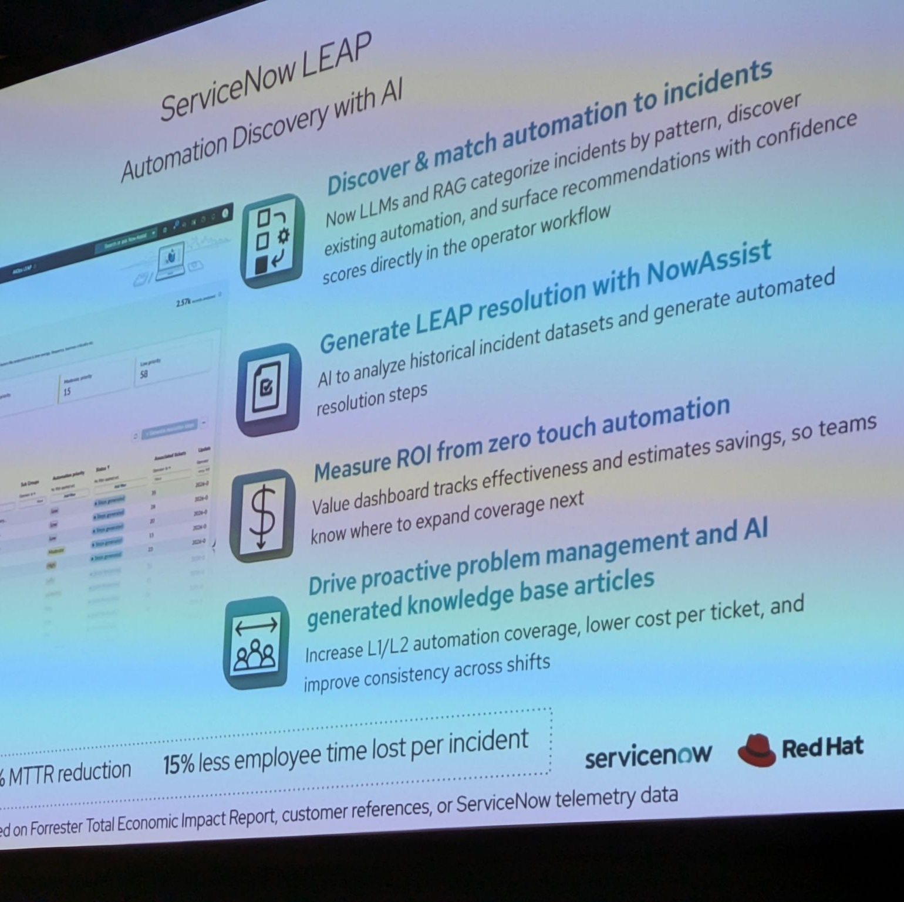

# AIOps Meets Agentic Automation: ServiceNow and Red Hat Transform IT Operations

- Date/Time (EDT): 2026-05-13, 2:20 PM - 2:50 PM
- Session Type: Session
- Source Archive Ref: 2026_13/AIOps_meets_agentic_automation_servicenow_and_redhat

## Overview
This session is a joint Red Hat and ServiceNow story about closing the gap between AI-driven incident discovery and governed remediation. The repeated message from both sides is that many organizations already have monitoring, service management, and automation platforms, but those systems remain organizationally and operationally disconnected.

The proposed bridge is a combination of ServiceNow LEAP and Red Hat Ansible Automation Platform. In this model, ServiceNow uses AI to cluster incidents, identify automation opportunities, and surface ROI, while Ansible provides the deterministic, approved execution layer through playbooks, audit trails, and policy boundaries. MCP is then used as the connective tissue that lets the AI-assisted discovery side locate and invoke the right automation safely.

## Key Themes
- AI for operations is most useful when it discovers patterns and opportunities, not just when it chats.
- Deterministic playbooks remain the trust boundary for enterprise remediation.
- Service-management teams and automation teams often need a common operating loop.
- LEAP is positioned as the intelligence layer that finds automation value and ROI.
- Human approvals remain compatible with AIOps and agentic workflows.

## Chronological Notes
### Shared Problem Statement
- The speakers begin by describing the fragmentation between service-management teams and automation teams.
- They connect that fragmentation to slower incident resolution, duplicated effort, lower trust, and underused investments.

### Ansible's Role in AIOps
- Red Hat's portion of the talk emphasizes pre-tested, reusable playbooks, approval gates, RBAC, and audit trails.
- Ansible is described as the execution boundary that lets AI act only through already approved operational logic.
- That point is reinforced with the statement that the automation library is the security boundary.

### ServiceNow LEAP's Role
- ServiceNow frames AI Ops as correlation and context-building across events, metrics, and logs.
- LEAP then analyzes historical incident data, clusters repeatable patterns, identifies automation opportunities, and estimates ROI.
- It also learns from how humans have historically resolved a class of incidents, turning those steps into better automation candidates.

### MCP and Cross-Platform Flow
- The demo shows how LEAP can connect through an Ansible MCP server to discover existing playbooks in automation hubs or source repositories.
- That allows the service-management side to find not only what should be automated, but which approved automation assets already exist.
- The broader pattern is event signal to correlation to AI recommendation to governed Ansible remediation to ticket closure.

### Practical Operating Model
- The speakers are explicit that zero-touch remediation is optional.
- Organizations can keep humans in the approval path and still benefit from AI-driven discovery, incident enrichment, and guided automation.
- That makes the session more credible than a blanket autonomy pitch.

## Technologies and Projects Mentioned
| Name | Type | Notes |
|---|---|---|
| ServiceNow LEAP | AI-enhanced automation platform | Finds automation opportunities and ROI from incident history |
| ServiceNow ITOM / ITSM | Operations and service-management platform | Provides incidents, workflows, and service context |
| Ansible Automation Platform | Automation platform | Executes approved playbooks and provides governance |
| MCP | Integration protocol | Connects AI-driven discovery to automation assets |
| Event-Driven Ansible | Automation pattern | Part of the event-to-remediation story |
| Automation Hub | Content repository | Stores certified automation content |

## Notable Takeaways
1. AI discovery without deterministic remediation is incomplete for enterprise operations.
2. LEAP's value proposition is less about replacing engineers and more about finding where automation should pay off first.
3. MCP becomes useful here because it helps AI systems discover approved playbooks rather than invent remediation from scratch.
4. Human approvals remain an entirely valid part of an AIOps operating model.

## Representative Visuals
Representative visuals retained from transcript-style PDFs or source photos:

- 
- 
- 
- 