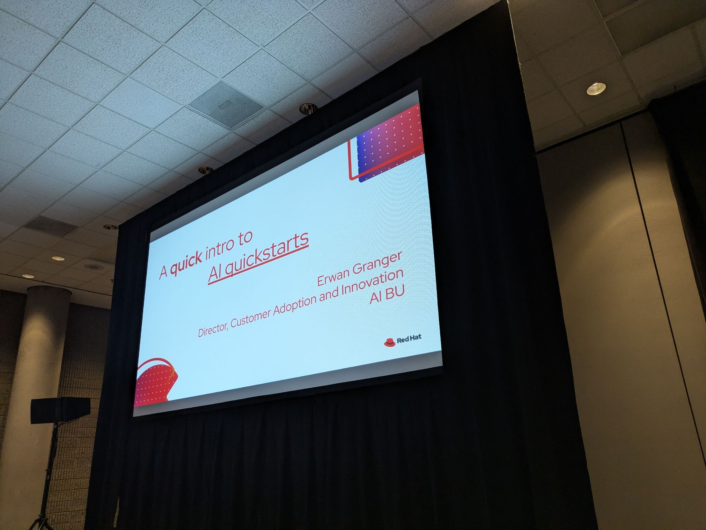
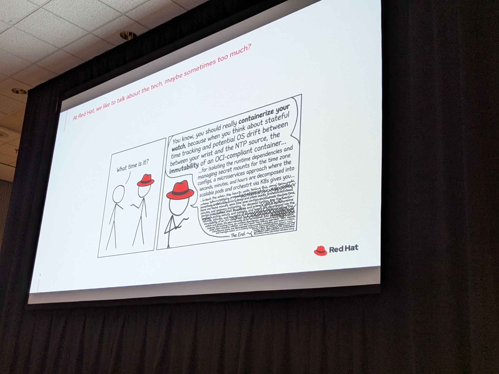
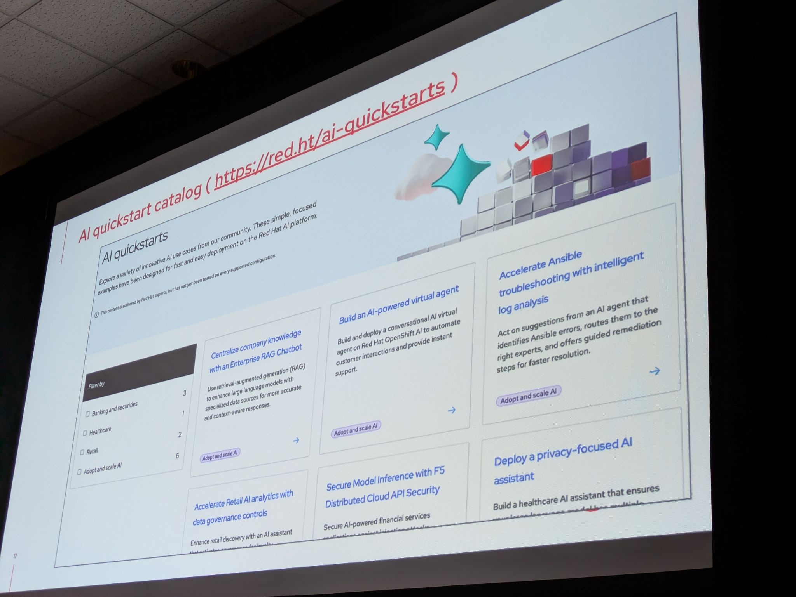
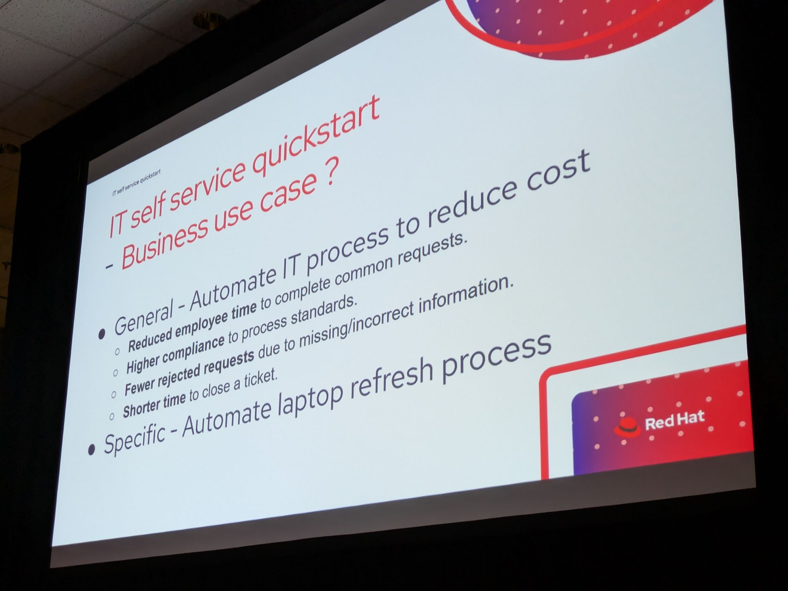

# Building Production-Ready AI Agents for Enterprise IT Automation with Red Hat AI

- Date/Time (EDT): 2026-05-14, 11:00 AM - 11:40 AM
- Session Type: Session
- Source Folder: otter_summaries/2026_14/building_production_ready_ai_agents_for_enterprise_IT_automation_with_RHOAI

## Overview
This talk uses Red Hat AI Quick Starts to show how teams can move from a business use case to a deployable agent architecture without pretending that a demo is already production. That distinction is central to the presentation: a Quick Start is meant to show the art of the possible and provide reusable components, but it is not a finished product and it is not a substitute for a customer's own production requirements.

The featured example is an IT self-service laptop-refresh agent. That example is useful because it combines multiple enterprise concerns in one workflow: user interaction over existing channels, routing, knowledge lookup, ServiceNow integration, prompt and tool control, observability, and deployment on OpenShift AI.

## Key Themes
- Production-ready thinking starts with a real business workflow, not a generic chatbot.
- AI Quick Starts are reference implementations and reusable building blocks, not boxed products.
- Enterprise agents should integrate with the communication channels and systems users already have.
- MCP, knowledge bases, and routing logic are essential for useful enterprise automation.
- Prompt structure, safety shields, and observability all affect whether an agent is reliable enough to extend.

## Chronological Notes
### What Quick Starts Are and Are Not
- The opening section makes a point of separating Quick Starts from production software.
- Quick Starts exist to illustrate target outcomes and give teams something concrete to deploy, inspect, and extend.
- They complement documentation, tutorials, and blog posts rather than replacing them.

### The Laptop-Refresh Use Case
- The featured example is an IT self-service laptop-refresh process.
- The business goal is to reduce friction, improve request quality, and shorten time to ticket closure by guiding users through the process.
- The talk deliberately chooses a familiar IT workflow so the architecture can be the focus.

### Architecture Pattern
- A request manager handles communication through channels such as Slack and email and preserves long-running conversation state.
- A routing agent decides which specialist agent should handle the user's request.
- The specialist agent uses MCP calls and knowledge-base lookups to pull user and policy information from systems such as ServiceNow.

### OpenShift AI and Supporting Components
- The example is deployed on OpenShift AI and uses LlamaStack, MCP integration, knowledge bases, hosted models, and safety shields.
- Supporting components mentioned in the talk include LangGraph for stateful flows, Kafka and eventing for durable conversations, PGVector for retrieval data, and observability plus evaluation tooling.
- This makes the example feel more like a composable platform pattern than a one-off app.

### Big Prompt vs Small Prompt
- One of the more useful engineering discussions is the comparison between big-prompt and small-prompt approaches.
- The big-prompt path is simpler but can stress smaller models and make control harder.
- The small-prompt approach uses a graph of narrower steps, which can improve reliability and validation in more constrained model environments.

## Technologies and Projects Mentioned
| Name | Type | Notes |
|---|---|---|
| AI Quick Starts | Reference implementation program | Provides reusable examples instead of finished products |
| LlamaStack / OGX | Inference and agent platform | Provides model and responses API capabilities |
| MCP | Integration protocol | Used to connect agents to enterprise systems such as ServiceNow |
| LangGraph | Agent workflow framework | Supports smaller-step conversational flows |
| Kafka | Messaging backbone | Used for durable, long-running conversation handling |
| PGVector | Vector storage | Supports retrieval and knowledge lookup |
| Llama Guard / Prompt Guard | Safety tooling | Used as shields in the architecture |

## Notable Takeaways
1. The talk is refreshingly explicit that demos and production systems are not the same thing.
2. The most reusable asset is the architecture pattern, not the specific laptop-refresh workflow.
3. Existing communication channels and systems of record should remain in the loop for enterprise agents.
4. Prompt design, tool wiring, and observability are all part of production readiness, not later refinements.

## Representative Visuals
Representative visuals retained from transcript-style PDFs or source photos:

- 
- 
- 
- 