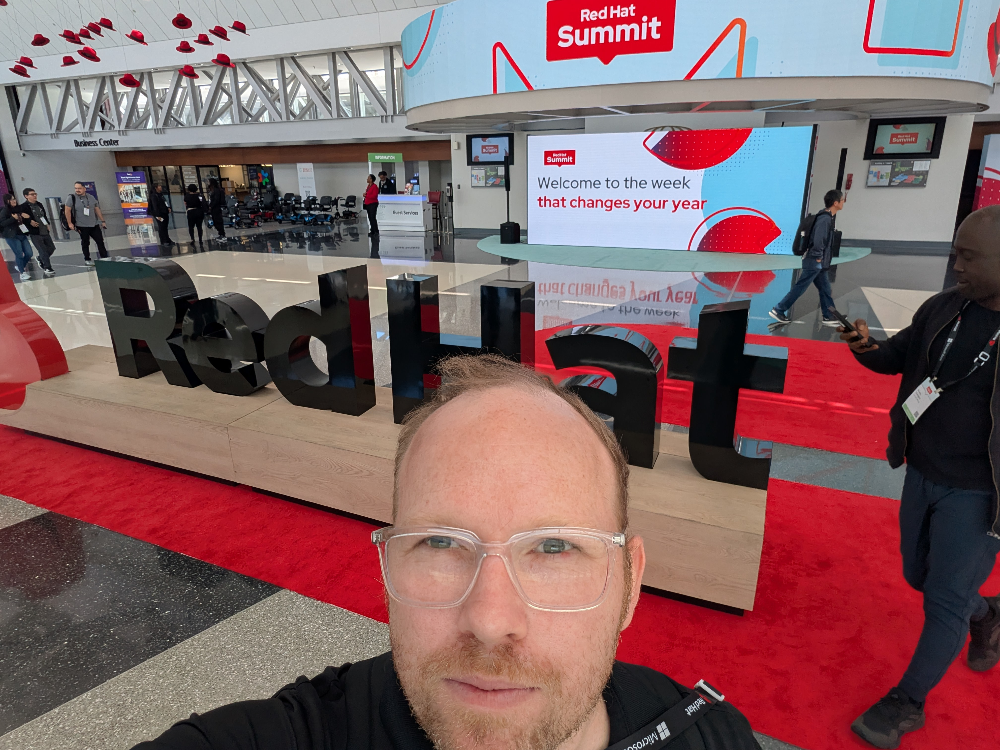

# Red Hat Summit 2026 - Session Summaries

This folder contains cleaned, structured summaries generated from transcript exports and optional PDF artifacts.

- Timezone convention: EDT
- Source archive references: sanitized for portability
- Current status: All currently captured Day 1 through Day 4 sessions, labs, and keynotes processed

## Timeline

### Day 1 - 2026-05-11

| Time (EDT) | Title | Type | Summary |
|---|---|---|---|
| 1:00 PM - 2:00 PM | Open Source Enterprise AI and the Human in the Loop | Community Day Session | [summary.md](20260511_1300_enterprise-ai-open-source-human-in-loop/summary.md) |
| 2:20 PM - 2:40 PM | Code, Environment, Data: The Holy Trinity of Reproducible Models | Community Day Session | [summary.md](20260511_1420_lakefs-reproducible-models/summary.md) |
| 2:40 PM - 3:00 PM | Mitigating AI's New Risk Frontier: Security and Safety | Community Day Session | [summary.md](20260511_1440_ai-security-and-safety-new-risk-frontier/summary.md) |
| 3:40 PM - 4:00 PM | GraphRAG and Agentic Pipelines on RHOAI | Community Day Session | [summary.md](20260511_1540-graph-rag-agentic-pipelines-on-rhoai/summary.md) |
| 4:15 PM - 4:30 PM | Benching AI Models with GuideLLM | Community Day Session | [summary.md](20260511_1315_guidellm-benchmarking-models/summary.md) |
| 4:40 PM - 5:00 PM | Guess and Check: Speculative Decoding Accelerates Inference | Community Day Session | [summary.md](20260511_1640-speculative-decoding-accelerates-inference/summary.md) |

### Day 2 - 2026-05-12

| Time (EDT) | Title | Type | Summary |
|---|---|---|---|
| 8:30 AM - 10:00 AM | The Next Platform Is Choice | Keynote | [summary.md](20260512_0830_the-next-platform-is-choice/summary.md) |
| 10:30 AM - 10:50 AM | Experimenting with vLLM on Kubernetes Using MicroShift, Podman Desktop, and KServe | Session | [summary.md](20260512_1030_experimenting-with-vllm-on-kubernetes-microshift-podman-kserve/summary.md) |
| 11:15 AM - 11:35 AM | Evaluation-Driven Development: AI Applications That Don't Lie | DevZone Session | [summary.md](20260512_1115_eval-driven-development-ai-apps/summary.md) |
| 11:45 AM - 12:25 PM | The Future of Red Hat Lightspeed | Session | [summary.md](20260512_1145_red-hat-lightspeed-roadmap/summary.md) |
| 1:00 PM - 1:40 PM | Beyond MLOps: Establishing AgentOps for Enterprise AI on Red Hat AI | Session | [summary.md](20260512_1300_beyond-mlops-establishing-agentops-for-enterprise-ai-on-red-hat-ai/summary.md) |
| 2:00 PM - 2:20 PM | Logs to Logic: Agentic AI Transforms Root Cause Analysis | Session | [summary.md](20260512_1400_logs-to-logic-agentic-ai-transforms-rca/summary.md) |
| 3:10 PM - 3:30 PM | Demystifying and Automating LLM Quantization | Session | [summary.md](20260512_1510_demystifying-and-automating-llm-quantization/summary.md) |
| 3:30 PM - 3:50 PM | Chain of Trust: The Hidden System Behind Validated and Benchmarked AI Models | Session | [summary.md](20260512_1530_chain-of-trust-validated-and-benchmarked-ai-models/summary.md) |
| 3:30 PM - 5:00 PM | Deploy an Agentic AI DevOps Assistant: Augmenting Incident Response with Red Hat OpenShift AI | Lab | [summary.md](20260512_1530_deploy-agentic-ai-devops-assistant-incident-response-with-rhoai/summary.md) |

### Day 3 - 2026-05-13

| Time (EDT) | Title | Type | Summary |
|---|---|---|---|
| 9:00 AM - 10:00 AM | The AI-Ready Enterprise Is Here | Keynote | [summary.md](20260513_0900_the-ai-ready-enterprise-is-here/summary.md) |
| 10:30 AM - 12:00 PM | AgentOps in Production: Agentic End-to-End Observability with Red Hat AI | Lab | [summary.md](20260513_1030_agentops-in-production-agentic-e2e-observability-with-red-hat-ai/summary.md) |
| 12:00 PM | The AI Trust Barrier: Why and How Enterprises Must Govern Autonomous Solutions for Adoption | Session | [summary.md](20260513_1200_the-ai-trust-barrier-governing-autonomous-solutions/summary.md) |
| 1:30 PM - 1:50 PM | Agent Skills with Quarkus and the LangChain4j Skills Module | Session | [summary.md](20260513_1330_agent-skills-with-quarkus-and-langchain4j/summary.md) |
| 2:20 PM - 2:50 PM | AIOps Meets Agentic Automation: ServiceNow and Red Hat Transform IT Operations | Session | [summary.md](20260513_1420_aiops-meets-agentic-automation-servicenow-and-red-hat/summary.md) |
| 3:30 PM - 5:00 PM | Protecting GenAI Apps with GAAS | Lab | [summary.md](20260513_1530_protecting-genai-apps-with-gaas/summary.md) |

### Day 4 - 2026-05-14

| Time (EDT) | Title | Type | Summary |
|---|---|---|---|
| 9:45 AM - 10:25 AM | Stop Guessing, Start Shipping: Automated RAG Pattern Discovery with Red Hat AI | Session | [summary.md](20260514_0945_automated-rag-pattern-discovery-with-red-hat-ai/summary.md) |
| 11:00 AM - 11:40 AM | Building Production-Ready AI Agents for Enterprise IT Automation with Red Hat AI | Session | [summary.md](20260514_1100_building-production-ready-ai-agents-for-enterprise-it-automation/summary.md) |
| 1:00 PM - 2:30 PM | Container Hardening: From Zero to Hero with Red Hat Hardened Images | Lab | [summary.md](20260514_1300_container-hardening-zero-to-hero-with-red-hat-hardened-images/summary.md) |

## Keynote Links
- The Next Platform Is Choice: https://www.youtube.com/watch?v=PgMSUGL4N5o
- The AI-Ready Enterprise Is Here: https://www.youtube.com/watch?v=6K8eqQ4ymvk

## Session Folder Layout
Each session folder follows this structure:

- summary.md
- source_bundle.txt
- img/
- img_manifest.csv
